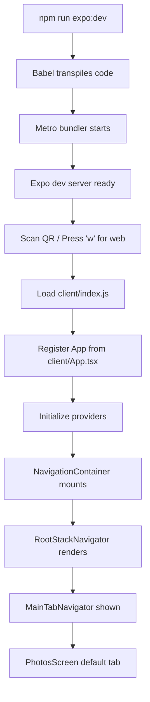
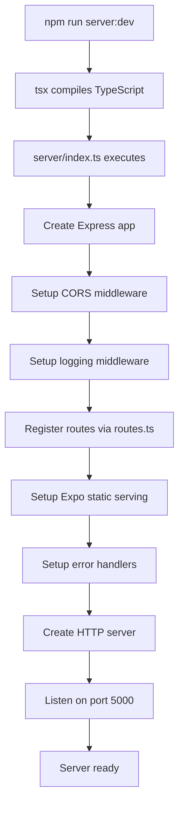

# Runtime Topology

[← Back to Index](./00_INDEX.md) | [← Previous: Overview](./10_OVERVIEW.md) | [Next: Modules →](./30_MODULES_AND_DEPENDENCIES.md)

## What Runs Where

Cloud Gallery has two runtime components that can run independently:

### 1. Mobile Application
- **Process**: Expo development server + React Native packager
- **Ports**: 8081 (Metro bundler), 19000+ (Expo dev tools)
- **Platforms**: iOS simulator, Android emulator, physical devices, web browser
- **State**: Runs on client device, stores data locally

### 2. Backend Server
- **Process**: Node.js Express server
- **Port**: 5000 (configurable via PORT env var)
- **Platforms**: Any Node.js-compatible environment
- **State**: Stateless (no active database in MVP)

## Environments

### Local Development

**Setup Steps**:
```bash
# 1. Install dependencies
npm install

# 2. Start backend server (Terminal 1)
npm run server:dev
# → Server runs at http://localhost:5000

# 3. Start mobile app (Terminal 2)
npm run expo:dev
# → Metro bundler at http://localhost:8081
# → Scan QR code with Expo Go app OR press 'w' for web
```

**Environment Variables (Replit-specific)**:
```bash
REPLIT_DEV_DOMAIN       # Dev domain for CORS
REPLIT_DOMAINS          # Comma-separated production domains
EXPO_PACKAGER_PROXY_URL # Proxy for Expo tunneling
REACT_NATIVE_PACKAGER_HOSTNAME # Hostname for Metro
EXPO_PUBLIC_DOMAIN      # Public-facing domain + port
```

**Data Storage**:
- Photos: Device local storage (AsyncStorage)
- No database connection required for MVP

**Evidence**:
- Server start: `server/index.ts` line 1-120
- Environment setup: `package.json` scripts section
- CORS setup: `server/index.ts` line 26-51

---

### Replit Cloud Environment

**Special Considerations**:
- Runs in a container with dynamic domain assignment
- Uses `REPLIT_DEV_DOMAIN` for URL construction
- CORS configured to allow both localhost and Replit domains
- Expo proxy configured via environment variables

**Boot Command** (from `.replit` if exists):
```bash
# Backend
npm run server:dev

# Frontend (separate shell)
npm run expo:dev
```

**Evidence**: 
- Package.json scripts use `$REPLIT_DEV_DOMAIN` variables
- CORS middleware: `server/index.ts` line 26-65

---

### Production Environment

**Current State**: Not deployed (MVP is local-only)

**Future Architecture**:
```
[Client Device]
      ↓
   Internet
      ↓
[Load Balancer] → [Express Server] → [PostgreSQL Database]
                       ↓
                  [File Storage] (S3/CloudFlare R2)
```

**Deployment Requirements** (when ready):
1. Node.js server hosting (e.g., Railway, Fly.io, Vercel)
2. PostgreSQL database
3. Object storage for photos (S3-compatible)
4. Environment variables for secrets

**Evidence**: 
- Database schema ready: `shared/schema.ts`
- Drizzle config: `drizzle.config.ts`

## Boot Sequence

### Mobile App Boot



**Step-by-Step**:

1. **Bundle preparation** (build-time)
   - Babel processes JSX/TypeScript → JavaScript
   - Module resolver handles `@/` imports
   - Assets registered with Metro

2. **App registration** (`client/index.js`)
   - Expo registers `App` component
   - Native bridge initialized

3. **Provider setup** (`client/App.tsx`)
   - ErrorBoundary wraps everything
   - QueryClientProvider for React Query
   - SafeAreaProvider for iOS notch handling
   - GestureHandlerRootView for gestures
   - KeyboardProvider for keyboard management
   - NavigationContainer for routing

4. **Navigation initialization** (`client/navigation/`)
   - RootStackNavigator loads
   - MainTabNavigator with 4 tabs
   - Default tab: PhotosScreen

5. **Data hydration**
   - React Query loads cached data (if any)
   - AsyncStorage reads photos/albums/user
   - UI renders with current data

**Evidence**:
- Entry point: `client/index.js` line 1-14
- Provider setup: `client/App.tsx` line 26-43
- Navigation root: `client/navigation/RootStackNavigator.tsx`
- Tab navigator: `client/navigation/MainTabNavigator.tsx`

---

### Backend Server Boot



**Step-by-Step**:

1. **Process start** (`server:dev` script)
   - `tsx` compiles TypeScript on-the-fly
   - NODE_ENV=development set
   - Runs `server/index.ts`

2. **Express setup** (`server/index.ts` line 17-30)
   - Create Express app
   - Enable trust proxy
   - JSON body parser

3. **CORS configuration** (line 26-65)
   - Allow Replit domains
   - Allow localhost (any port)
   - Allow credentials

4. **Middleware chain** (line 67-85)
   - Request logger (logs all requests)
   - Raw body capture
   - Static file serving

5. **Route registration** (`server/routes.ts`)
   - Currently empty (no API routes)
   - Ready for `/api/*` routes

6. **Static serving** (line 87-110)
   - Serves Expo static build from `/dist`
   - Landing page for Expo Go
   - Custom 404 handler

7. **Error handlers** (line 112-130)
   - Development: full stack traces
   - Production: sanitized messages

8. **HTTP server start** (line 134-143)
   - Listen on PORT env var or 5000
   - Log startup message

**Evidence**:
- Server entry: `server/index.ts` line 1-150
- Route registration: `server/routes.ts` line 15-22
- Package.json server script: line 17

---

## Process Dependencies

### Mobile App Depends On
- ✅ Metro bundler (started by Expo)
- ✅ Device/emulator with Expo Go app
- ❌ Backend server (not required for MVP)
- ❌ Database (not required for MVP)
- ❌ Internet (works offline after initial load)

### Backend Server Depends On
- ✅ Node.js runtime
- ❌ Database (not connected in MVP)
- ❌ Mobile app (can run independently)

### Future Dependencies
- PostgreSQL database
- Object storage service (S3/R2)
- Authentication service

## Health Checks

### Mobile App
```bash
# Check Metro bundler is running
curl http://localhost:8081/status
# Should return: "packager-status:running"

# Check app is built
ls -la client/.expo/
```

### Backend Server
```bash
# Check server is responding
curl http://localhost:5000/
# Should return HTML landing page

# Check CORS headers
curl -I -X OPTIONS http://localhost:5000/ \
  -H "Origin: http://localhost:8081"
# Should include Access-Control-Allow-Origin header
```

## Troubleshooting

### "Metro bundler not starting"
```bash
# Clear cache and restart
npx expo start --clear
```

### "Cannot connect to server"
```bash
# Verify server is running
lsof -i :5000

# Check CORS configuration
# Edit server/index.ts CORS origins if needed
```

### "AsyncStorage not persisting"
```bash
# Clear app data on device
# iOS: Settings → General → iPhone Storage → Cloud Gallery → Delete App
# Android: Settings → Apps → Cloud Gallery → Clear Data
```

### "TypeScript errors on startup"
```bash
# Verify dependencies installed
npm install

# Check TypeScript
npm run check:types
```

## Performance Considerations

### Mobile App
- **FlashList**: Requires fixed item sizes for optimal performance
  - Photo grid: 3 columns, item size based on screen width
  - See `client/components/PhotoGrid.tsx` line 40-50
- **Image Caching**: Expo Image handles caching automatically
- **Navigation**: React Navigation uses native stack for performance

### Backend Server
- **Static files**: Cached by Express for faster serving
- **CORS**: Checked on every request (minimal overhead)
- **Logging**: Logs to console (configure external logger for production)

## Evidence Files

**Boot Sequence**:
- `/client/index.js` - Expo entry point
- `/client/App.tsx` - Provider setup
- `/server/index.ts` - Express server setup

**Environment**:
- `/package.json` - Scripts and environment variables
- `/app.json` - Expo configuration
- `/drizzle.config.ts` - Database configuration (unused in MVP)

**Configuration**:
- `/babel.config.js` - Transpiler configuration
- `/tsconfig.json` - TypeScript paths and options
- `/eslint.config.js` - Code quality rules

---

[← Back to Index](./00_INDEX.md) | [← Previous: Overview](./10_OVERVIEW.md) | [Next: Modules →](./30_MODULES_AND_DEPENDENCIES.md)
